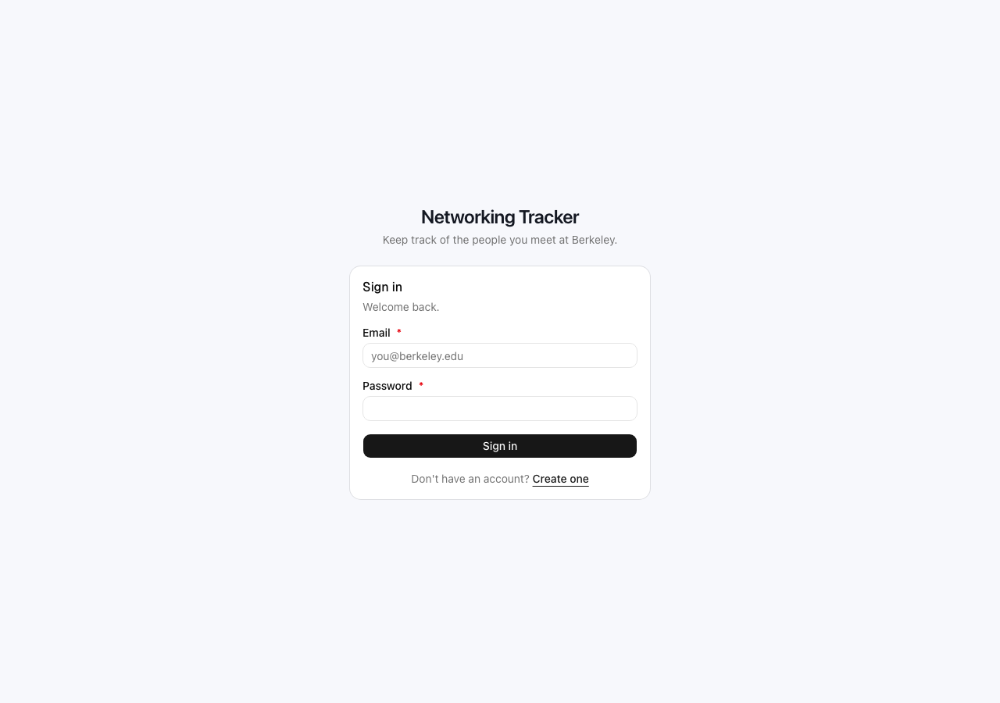
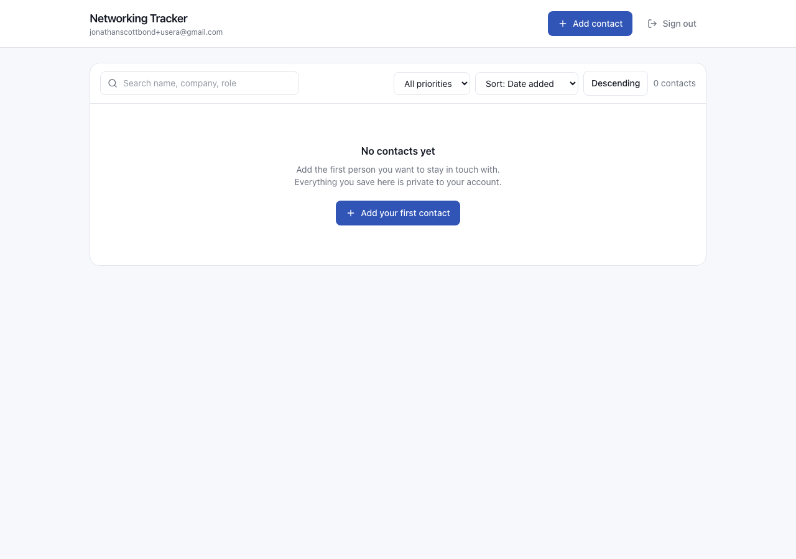
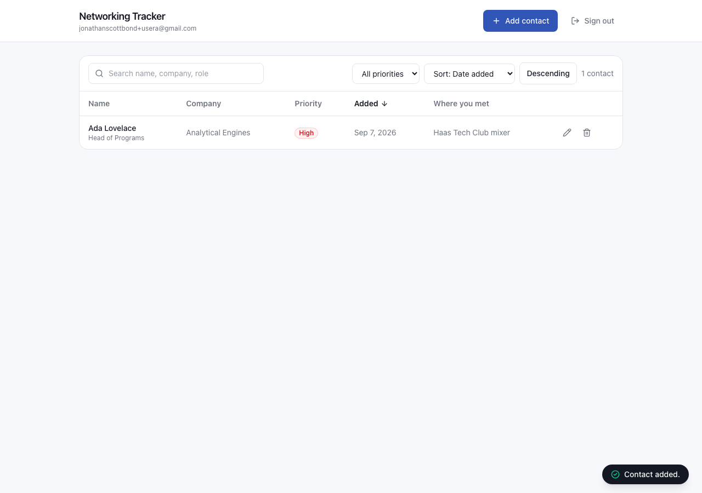
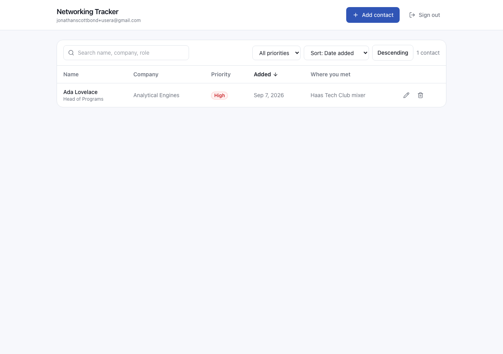
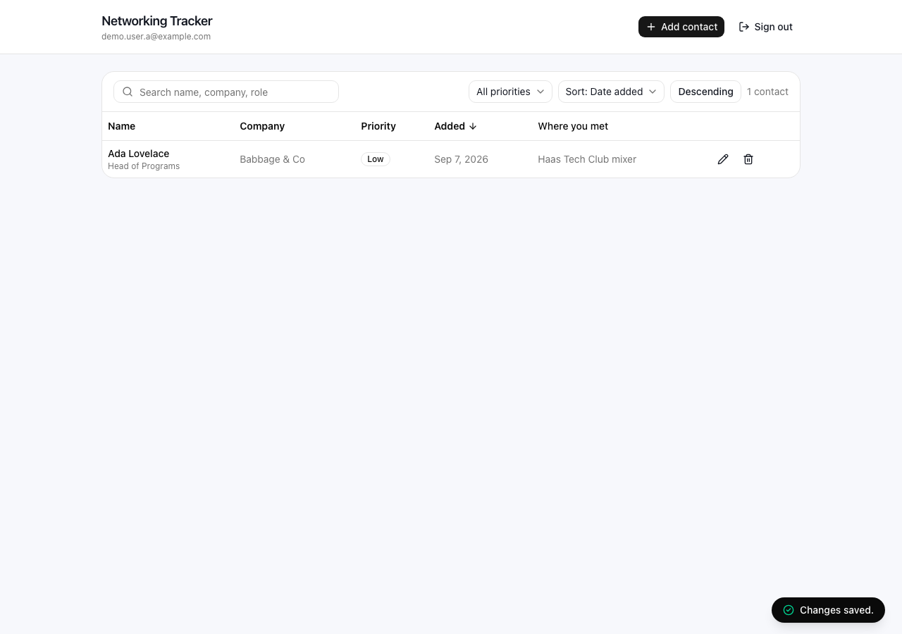
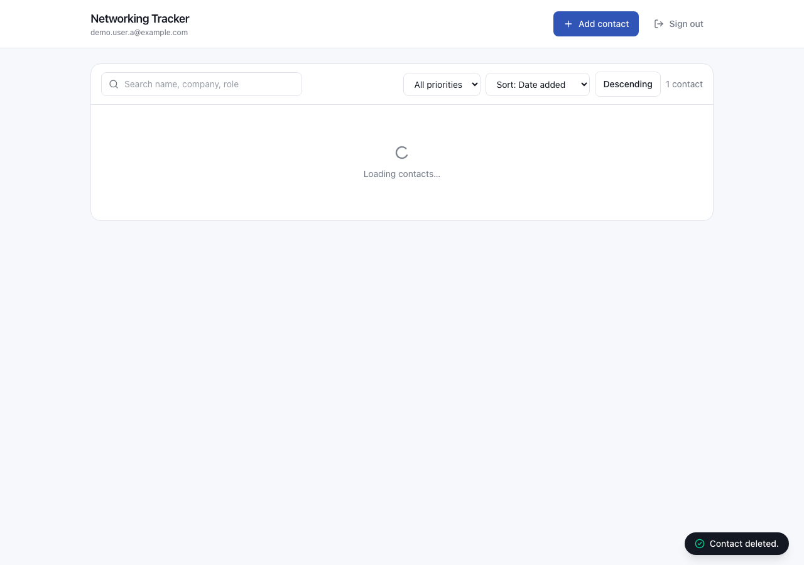
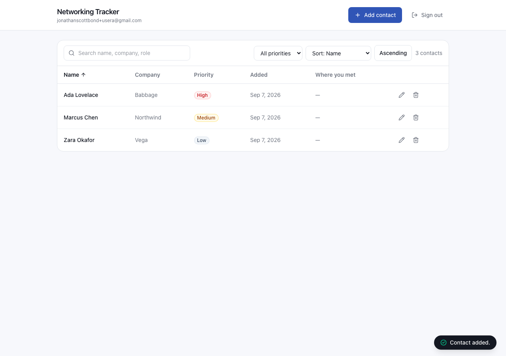
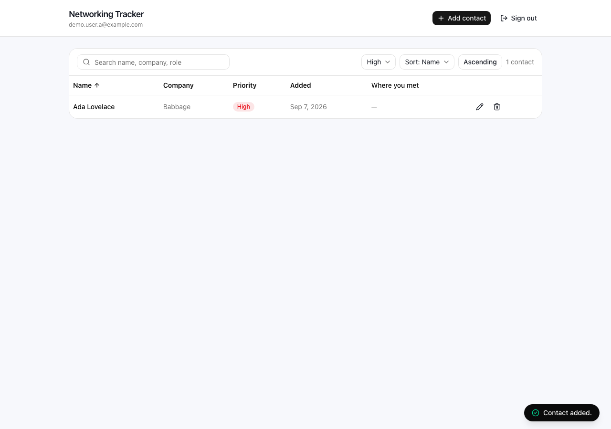
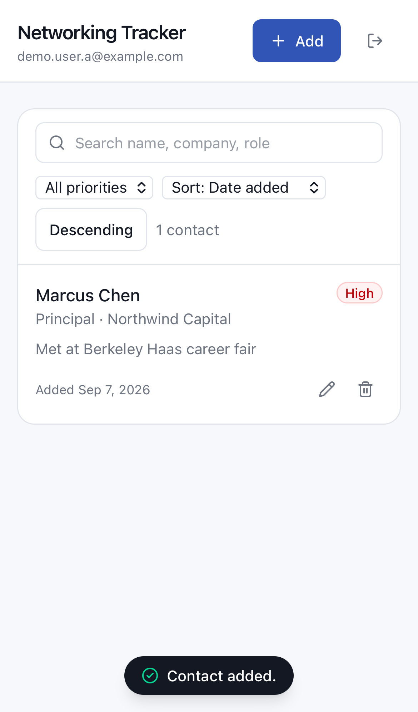
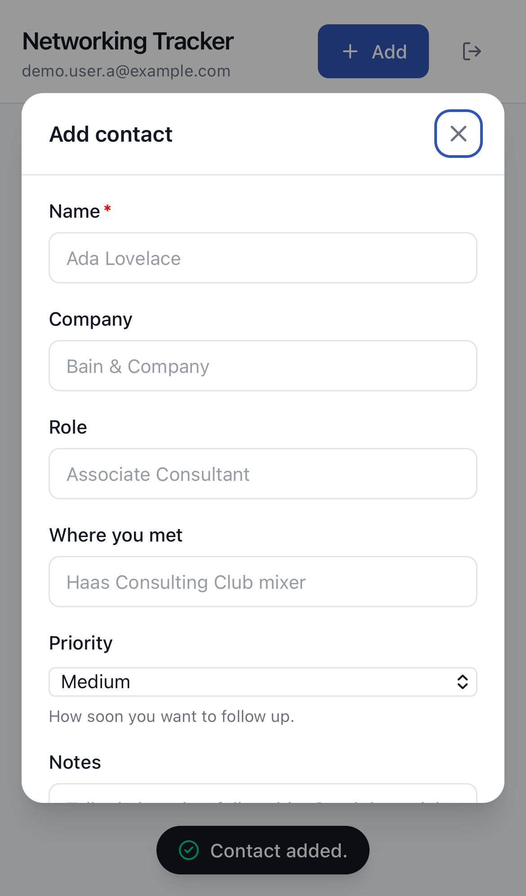

# Networking Tracker

A private contact tracker for the people you meet at Berkeley. You sign in, add
the people you want to stay connected with — name, company, role, where you met,
notes, and how urgently you want to follow up — and the list is yours alone.
Every row in the database is stamped with the id of the user who created it, and
Postgres itself refuses to hand a row to anyone else. That last part is the point
of the project: the security boundary is Row Level Security in the database, not
a filter in application code that could be forgotten or bypassed.

**Live app:** https://networking-tracker-nine-fawn.vercel.app
**API:** https://networking-tracker-api-alpha.vercel.app

Every screenshot below was captured from that deployed URL, and the test results
were produced against it.

---

## Contents

- [Screenshots](#screenshots)
- [Features](#features)
- [Technology stack](#technology-stack-and-why)
- [Architecture](#architecture)
- [Request flow](#request-flow-end-to-end)
- [Local setup](#local-setup)
- [Environment variables](#environment-variables)
- [Database schema](#database-schema)
- [Authentication and RLS ownership](#authentication-and-rls-ownership)
- [Tests](#tests)
- [Grading evidence](#grading-evidence)
- [Deployment](#deployment)
- [Known limitations](#known-limitations-and-what-id-do-next)

---

## Screenshots

Every image below is generated by the Playwright suite (`npm run test:e2e`), so
the evidence is reproducible rather than hand-captured.

| | |
| --- | --- |
| **Sign in** | **Signed in, empty state** |
|  |  |
| **Contact created** | **Survives a browser refresh** |
|  |  |
| **Edited** | **Deleted** |
|  |  |
| **Sorted by name** | **Filtered to high priority** |
|  |  |
| **Mobile list** | **Mobile form** |
|  |  |

---

## Features

- Email and password sign-up, sign-in, and sign-out via Neon Managed Better Auth
- Add a contact with name, company, role, where you met, notes, and priority
- Priority is restricted to `high`, `medium`, or `low` at three independent layers
- View contacts as a sortable table on desktop and stacked cards on mobile
- Sort by name, company, priority, date added, or last updated — ascending or
  descending, performed in Postgres so it stays correct as the list grows
- Filter by priority and search across name, company, and role
- Edit and delete your own contacts, with a confirmation step before deleting
- Data persists in Neon Postgres and survives a browser refresh
- Distinct loading, empty, success, and error states throughout
- Responsive from a 390px phone to a desktop browser
- Keyboard accessible: visible focus rings, labelled inputs, `role="alert"` errors

---

## Technology stack and why

| Layer | Choice | Why |
| --- | --- | --- |
| Frontend | Vite + React 19 + TypeScript | A standalone single-page app, deployed independently of the API. TypeScript catches shape mismatches between the two at build time. |
| Styling | Tailwind CSS v4 | Utility-first styling with a small custom design token set (`--color-brand`, `--color-line`, …) defined once in `frontend/src/index.css`. Responsive breakpoints come for free, which is what makes the mobile layout cheap to maintain. |
| Icons | lucide-react | Consistent, accessible icon set. |
| Backend | Node + Express 5 + TypeScript | A separate service with its own deployment, its own environment variables, and its own responsibilities: verify the token, validate the input, forward the query. |
| Validation | Zod | One schema defines both the runtime check and the TypeScript type, so they cannot drift apart. |
| Token verification | jose | Verifies the JWT signature against Neon's public JWKS endpoint. No shared secret to leak. |
| Database | Neon Postgres | Serverless Postgres with real RLS — the feature the whole security design rests on. |
| Auth | Neon Managed Better Auth | Neon hosts the auth service and issues JWTs. This app never sees or stores a password. |
| Data access | Neon Data API (PostgREST) | An HTTPS interface to Postgres that validates JWTs and enforces RLS per request. |
| Client SDK | `@neondatabase/neon-js` | Used in its two-URL object form (one URL for auth, one for the Data API). |
| Hosting | Vercel | Two projects from one repository: a static build for the frontend, serverless functions for the API. |
| Tests | Vitest + Playwright | Vitest for fast validation unit tests and live integration tests; Playwright for end-to-end flows that also generate the screenshots in this README. |

---

## Architecture

The frontend and backend are genuinely separate: separate `package.json` files,
separate builds, separate Vercel projects, separate environment variables. They
communicate only over HTTPS with a bearer token.

```
┌──────────────────────────────────────┐
│  React SPA  (Vite, Vercel static)    │
│                                      │
│  sign in / sign up / sign out  ──────┼──────────►  Neon Managed Better Auth
│                                      │             (public auth URL)
│  fetch /api/contacts                 │                    │
│  Authorization: Bearer <JWT>         │            issues a signed JWT
└──────────────┬───────────────────────┘                    │
               │  ◄─────────────────────────────────────────┘
               ▼
┌──────────────────────────────────────┐
│  Node + Express  (Vercel function)   │
│                                      │
│  1. jose.jwtVerify vs Neon's JWKS    │  ← rejects forged or expired tokens
│  2. Zod validates the request body   │  ← rejects empty names, bad priorities
│  3. forwards the SAME user JWT       │
└──────────────┬───────────────────────┘
               ▼
┌──────────────────────────────────────┐
│  Neon Data API  (PostgREST)          │
│  validates the JWT, sets the         │
│  `authenticated` role                │
└──────────────┬───────────────────────┘
               ▼
┌──────────────────────────────────────┐
│  Neon Postgres                       │
│  RLS:  auth.user_id() = user_id      │  ← the real security boundary
│  CHECK: priority IN (high,medium,low)│
│  CHECK: name is not blank            │
└──────────────────────────────────────┘
```

### The design decision worth explaining

The backend does **not** hold a privileged database credential in the request
path. It forwards the caller's own JWT to the Data API, so Postgres evaluates
`auth.user_id()` against the real end user on every single query.

The consequence: even if a route handler in `backend/src/routes/contacts.ts` had
a bug — a missing filter, a wrong id — it still could not return another user's
row, because the database would refuse. Notice that the `GET /api/contacts`
handler contains no `user_id` filter at all. It does not need one. RLS scopes the
result set.

`DATABASE_URL` is used in exactly one place: `db/migrate.ts`, run manually to
create the schema. It is never imported by any request handler.

### Three independent layers reject bad data

1. **The browser** (`frontend/src/components/ContactForm.tsx`) — instant feedback.
   A convenience, not a security control.
2. **The Node backend** (`backend/src/validation.ts`) — Zod schemas. This is the
   trusted server-side validation, and it runs whether the request came from the
   UI or from `curl`.
3. **Postgres** (`db/schema.sql`) — `CHECK` constraints on `name` and `priority`.
   The last line of defense; it holds even if both layers above were removed.

---

## Request flow, end to end

Adding a contact:

1. You submit the form. `ContactForm` does a quick client-side check for a
   non-empty name so you get an immediate error rather than a round trip.
2. `frontend/src/lib/api.ts` asks Neon for the current session's JWT, then
   `POST`s to `/api/contacts` with `Authorization: Bearer <jwt>`. The request body
   contains **no user id** — the browser has no way to claim to be someone else.
3. `backend/src/auth.ts` verifies the JWT's signature against Neon's public JWKS
   endpoint and pulls the `sub` claim out of it. An invalid or expired token stops
   here with a 401.
4. `backend/src/validation.ts` parses the body. The schema is `.strict()`, so a
   request that tries to smuggle in a `user_id` field is rejected outright rather
   than having it silently dropped.
5. `backend/src/dataApi.ts` forwards the insert to the Neon Data API, carrying the
   same JWT.
6. Postgres inserts the row. `user_id` is not supplied, so its default —
   `auth.user_id()` — fills in the `sub` claim from the verified token. The
   `contacts_insert_own` policy's `WITH CHECK` then confirms the new row really
   does belong to the caller.
7. The created row comes back up the chain and the list refreshes.

Reading contacts is the same path in reverse, and the interesting part is what is
missing: no step filters by user. The `contacts_select_own` policy does it.

---

## Local setup

### Prerequisites

- Node.js 20 or newer
- A free [Neon](https://neon.tech) account

### 1. Clone and install

```bash
git clone https://github.com/OskitheBear1/agentic-ai-assignment-1.git
cd agentic-ai-assignment-1
npm run install:all
```

### 2. Create the Neon project

In the [Neon console](https://console.neon.tech):

1. Create a project.
2. Open **Auth** and enable **Managed Better Auth**. Copy the **Auth URL**.
3. Open **Data API**, tick **Grant public schema access**, and enable it. Copy the
   **Data API URL**.
4. From the project dashboard, copy the **connection string** (`postgresql://…`).

### 3. Configure environment variables

```bash
cp .env.example backend/.env.local
cp .env.example frontend/.env.local
```

Fill in the real values in each file. See
[Environment variables](#environment-variables) for which variable belongs where.

### 4. Create the schema and RLS policies

```bash
npm run migrate
```

This applies `db/schema.sql` and `db/policies.sql`, then queries `pg_policies` and
prints what it created. It exits non-zero unless RLS is enabled and exactly four
policies exist, so a partial migration cannot pass silently.

### 5. Run it

```bash
npm run dev
```

That starts both services together — the API on http://localhost:3000 and the
app on http://localhost:5173. To run them in separate terminals instead, use
`npm run dev:backend` and `npm run dev:frontend`.

Open http://localhost:5173 and create an account.

---

## Environment variables

Copy `.env.example` — it contains placeholders only, and the real `.env.local`
files are gitignored.

### Frontend — public, compiled into the browser bundle

Vite requires the `VITE_` prefix. These are the non-Next.js equivalents of the
`NEXT_PUBLIC_*` names in the assignment brief.

| Variable | Purpose |
| --- | --- |
| `VITE_NEON_AUTH_URL` | Neon Managed Better Auth endpoint (equivalent to `NEXT_PUBLIC_NEON_AUTH_URL`) |
| `VITE_NEON_DATA_API_URL` | Neon Data API endpoint (equivalent to `NEXT_PUBLIC_NEON_DATA_API_URL`) |
| `VITE_API_URL` | Base URL of this project's Node backend |

**These are safe to publish.** They are HTTPS endpoints, not credentials. An
attacker who reads them out of the JavaScript bundle gains nothing, because the
Data API refuses every request without a valid JWT and RLS restricts a valid JWT
to that user's own rows. URL secrecy is not part of the security model.

### Backend — server-only, never bundled

| Variable | Purpose |
| --- | --- |
| `NEON_AUTH_URL` | Used to fetch the JWKS at `<url>/.well-known/jwks.json` and verify token signatures |
| `NEON_DATA_API_URL` | Where verified requests are forwarded |
| `FRONTEND_URL` | Comma-separated CORS allowlist |
| `PORT` | Local dev port (Vercel sets its own) |
| **`DATABASE_URL`** | **Secret.** The Postgres connection string. Used only by `db/migrate.ts`; never at request time, never in the frontend project |
| `TEST_USER_A_EMAIL` / `TEST_USER_A_PASSWORD` | Test account for the integration tests |
| `TEST_USER_B_EMAIL` / `TEST_USER_B_PASSWORD` | Second test account, for the privacy test |

`NEON_AUTH_BASE_URL` and `NEON_AUTH_COOKIE_SECRET` are **not used** by this
implementation. They are needed only when your own server hosts the Better Auth
request handler. Here the browser talks to Neon-hosted auth directly and the
backend only verifies the resulting JWT, so there is no cookie secret to hold. If
they were used, they would be server-only.

### Publishable versus secret, in one line

Publishable: the two HTTPS endpoint URLs, because RLS — not obscurity — protects
the data. Secret: `DATABASE_URL`, because it is a direct database credential that
bypasses the Data API and the `authenticated` role entirely.

---

## Database schema

`db/schema.sql`:

```sql
CREATE TABLE contacts (
  id         bigint GENERATED BY DEFAULT AS IDENTITY PRIMARY KEY,
  user_id    text        NOT NULL DEFAULT (auth.user_id()),
  name       text        NOT NULL CHECK (length(btrim(name)) > 0),
  company    text,
  role       text,
  where_met  text,
  notes      text,
  priority   text        NOT NULL DEFAULT 'medium'
                         CHECK (priority IN ('high', 'medium', 'low')),
  created_at timestamptz NOT NULL DEFAULT now(),
  updated_at timestamptz NOT NULL DEFAULT now()
);

CREATE INDEX contacts_user_id_idx ON contacts (user_id);
```

| Column | Type | Notes |
| --- | --- | --- |
| `id` | `bigint` identity | Primary key |
| `user_id` | `text NOT NULL` | Owner. Defaults to `auth.user_id()` — the `sub` claim of the verified JWT. The client never supplies it |
| `name` | `text NOT NULL` | `CHECK` rejects blank or whitespace-only names |
| `company` | `text` | Optional |
| `role` | `text` | Optional |
| `where_met` | `text` | Optional |
| `notes` | `text` | Optional |
| `priority` | `text NOT NULL` | Defaults to `medium`; `CHECK` restricts it to `high`, `medium`, `low` |
| `created_at` | `timestamptz NOT NULL` | Defaults to `now()` |
| `updated_at` | `timestamptz NOT NULL` | Maintained by a `BEFORE UPDATE` trigger, so the client cannot backdate it |

---

## Authentication and RLS ownership

### Authentication

Neon Managed Better Auth hosts the sign-up and sign-in endpoints. The browser
posts credentials directly to Neon and receives a signed JWT. This project never
sees a password, stores no credentials, and holds no signing key.

The backend verifies each incoming token against Neon's **public** JWKS endpoint
(`<NEON_AUTH_URL>/.well-known/jwks.json`) using `jose`. Public-key verification
means there is no shared secret that could leak from the API.

### The ownership rule

Every policy expresses the same rule: **`auth.user_id() = user_id`**.

`auth.user_id()` is a Neon-provided function that returns the `sub` claim of the
JWT the Data API just verified, as `text`. `user_id` is the column on the row. If
they do not match, the row does not exist as far as that request is concerned.

`db/policies.sql`:

```sql
ALTER TABLE contacts ENABLE ROW LEVEL SECURITY;
ALTER TABLE contacts FORCE ROW LEVEL SECURITY;

CREATE POLICY contacts_select_own ON contacts
  FOR SELECT TO authenticated
  USING (auth.user_id() = user_id);

CREATE POLICY contacts_insert_own ON contacts
  FOR INSERT TO authenticated
  WITH CHECK (auth.user_id() = user_id);

CREATE POLICY contacts_update_own ON contacts
  FOR UPDATE TO authenticated
  USING (auth.user_id() = user_id)
  WITH CHECK (auth.user_id() = user_id);

CREATE POLICY contacts_delete_own ON contacts
  FOR DELETE TO authenticated
  USING (auth.user_id() = user_id);
```

Four separate policies rather than one `FOR ALL`, so each operation's rule is
explicit and auditable.

**`USING` versus `WITH CHECK`.** `USING` decides which existing rows an operation
is allowed to touch. `WITH CHECK` decides what a row is allowed to look like
*after* a write. The `WITH CHECK` on `UPDATE` is what prevents a user from
reassigning a row to somebody else: the row must still belong to them once the
update is applied, so setting `user_id` to another user's id fails. That case is
covered by a test.

`FORCE ROW LEVEL SECURITY` extends the policies to the table owner too, so no
connection path quietly bypasses them.

Signed-out visitors get nothing: the `anonymous` role has no privileges on
`contacts`, which the privacy test also asserts.

---

## Tests

### Unit tests — no database or network required

```bash
npm test
```

Runs `backend/tests/validation.test.ts` against `backend/src/validation.ts`. It
verifies that the server rejects a missing, empty, or whitespace-only name;
rejects any priority other than `high`, `medium`, or `low`; defaults priority to
`medium`; trims whitespace; rejects an unknown sort column before it could reach
SQL; and rejects any request body that tries to set `user_id`, `id`, or
`created_at`.

```
 RUN  v3.2.7 /agentic-ai-assignment-1/backend

 ✓ tests/validation.test.ts (34 tests) 5ms

 Test Files  1 passed (1)
      Tests  34 passed (34)
   Duration  361ms
```

All 34 assertions cover the rules above. The suite runs in under half a second
because it touches nothing external.

### Live integration tests — real Neon, running backend

With the backend running (`npm run dev:backend`):

```bash
npm run test:privacy   # the two-account test
npm run test:live      # privacy + server-side validation
```

`backend/tests/privacy.test.ts` signs in as two real accounts and proves User A
cannot reach User B's data by any route — through the API *and* by calling the
public Data API directly with a valid token, which is the attack RLS has to stop.

`backend/tests/server-validation.test.ts` posts invalid bodies straight to the
running API, bypassing the browser entirely, and asserts each one fails with a
clear 400 rather than a crash or a partial write.

Both suites pass against real Neon:

```
 ✓ tests/server-validation.test.ts (10 tests) 1355ms
 ✓ tests/privacy.test.ts (13 tests) 3190ms

 Test Files  2 passed (2)
      Tests  23 passed (23)
```

### End-to-end tests — also the screenshot generator

```bash
npx playwright install    # first run only
npm run test:e2e
```

Covers sign-in and sign-out, the full create/view/edit/delete cycle, persistence
across a refresh, sorting, filtering, search, invalid input, the two-user privacy
check, and the mobile layout — writing the screenshots in this README as it goes.

```
 ✓ [desktop] › auth.spec.ts › sign in and sign out (2.8s)
 ✓ [desktop] › contacts.spec.ts › create, view, edit, delete, and survive a refresh (9.3s)
 ✓ [desktop] › contacts.spec.ts › sort and filter (13.0s)
 ✓ [desktop] › privacy.spec.ts › User A cannot see User B contacts (8.7s)
 ✓ [desktop] › validation.spec.ts › an empty name is rejected with a clear message (2.1s)
 ✓ [mobile]  › responsive.spec.ts › mobile layout (6.2s)

  6 passed (44.5s)
```

Point it at production instead of localhost:

```bash
E2E_BASE_URL=https://networking-tracker-nine-fawn.vercel.app TEST_ORIGIN=https://networking-tracker-nine-fawn.vercel.app npm run test:e2e
```

---

## Grading evidence

| Requirement | Evidence |
| --- | --- |
| App is live at a public URL | https://networking-tracker-nine-fawn.vercel.app |
| Sign in and sign out | [`docs/01-sign-in-page.png`](docs/01-sign-in-page.png), [`docs/02-signed-in.png`](docs/02-signed-in.png), [`docs/03-signed-out.png`](docs/03-signed-out.png) |
| Add, view, edit, delete, survives refresh | [`docs/04`](docs/04-empty-state.png)–[`docs/08`](docs/08-contact-deleted.png) |
| Sort and filter | [`docs/09-sorted-by-name.png`](docs/09-sorted-by-name.png), [`docs/10-filtered-high-priority.png`](docs/10-filtered-high-priority.png), [`docs/11-search-results.png`](docs/11-search-results.png) |
| Invalid input fails safely | [`docs/12-invalid-empty-name.png`](docs/12-invalid-empty-name.png), plus `backend/tests/server-validation.test.ts` |
| User A cannot access User B's contacts | [`docs/13-user-b-contacts.png`](docs/13-user-b-contacts.png), [`docs/14-user-a-cannot-see-user-b.png`](docs/14-user-a-cannot-see-user-b.png), plus `backend/tests/privacy.test.ts` |
| Automated test passes | 34 unit + 23 live + 6 end-to-end, all passing — output above |
| Secrets are server-only | [Environment variables](#environment-variables); `DATABASE_URL` appears only in `db/migrate.ts` |
| Schema and RLS explained | [Database schema](#database-schema), [Authentication and RLS ownership](#authentication-and-rls-ownership) |
| Mobile friendly | [`docs/15-mobile-list.png`](docs/15-mobile-list.png), [`docs/16-mobile-form.png`](docs/16-mobile-form.png) |

---

## Deployment

Two Vercel projects from this one repository.

### Backend

1. Import the repository into Vercel. Set **Root Directory** to `backend`.
2. Add environment variables: `NEON_AUTH_URL`, `NEON_DATA_API_URL`,
   `FRONTEND_URL` (the frontend's Vercel domain).
   Do **not** add `DATABASE_URL` — the API never uses it.
3. Deploy. `backend/vercel.json` rewrites every path to `api/index.ts`, which
   exports the Express app as a serverless function.
4. Check `https://networking-tracker-api-alpha.vercel.app/health` returns `{"status":"ok"}`.

   **Note:** `VITE_`-prefixed variables cannot be stored as *sensitive* on
   Vercel — they are public by definition, and the CLI needs `--no-sensitive`.
   A silently missing one becomes `undefined` in the bundle at build time, so
   `frontend/src/lib/neon.ts` checks for it and names the variable instead of
   failing on a blank page.

### Frontend

1. Import the same repository as a second project. Set **Root Directory** to
   `frontend`.
2. Add environment variables: `VITE_NEON_AUTH_URL`, `VITE_NEON_DATA_API_URL`,
   and `VITE_API_URL` (the backend's Vercel domain).
3. Deploy.

### Finish

1. In the Neon console, add the frontend's Vercel domain to **Auth → trusted
   origins**, then confirm sign-in works there.
2. Open the public URL in a private window, create two accounts, and repeat the
   privacy test in production.
3. Run the checklist below against the live URL.

### Definition-of-done checklist

All verified against the deployed application, not just locally:

- [x] Live at a public URL — https://networking-tracker-nine-fawn.vercel.app
- [x] Sign in and sign out work — `auth.spec.ts` against production
- [x] Add, view, edit, delete, sort, filter all work — `contacts.spec.ts`
- [x] Data survives a refresh — asserted after `page.reload()`
- [x] User A cannot see or change User B's contacts — 13 tests against the
      production API *and* directly against the public Data API
- [x] Invalid data fails with a clear message — 10 tests posting invalid bodies
      straight to the production API
- [x] `npm test` passes — 34 validation unit tests
- [x] No secret appears in frontend code or Git history — `DATABASE_URL` is set
      on neither Vercel project; the built bundle contains only the three public
      URLs

---

## Known limitations and what I'd do next

- **No pagination.** Every contact is fetched at once. Fine for a personal
  network; at a few thousand rows it would need cursor-based pagination, which
  the Data API supports via `Range` headers.
- **No optimistic updates.** After a write the list is refetched, which is one
  extra round trip. Updating local state first would feel faster, at the cost of
  reconciliation logic.
- **Follow-up dates aren't modelled.** Priority captures urgency but not *when*.
  A `follow_up_on date` column plus a "due this week" filter would make the app
  genuinely useful rather than just a record.
- **Email and password only.** Neon Managed Better Auth also supports Google and
  email OTP sign-in; enabling them is configuration, not new code.
- **A cold serverless function adds latency to the first request.** The JWKS fetch
  is cached in-process, but a new instance pays for it once.
- **Tests write to the real database.** The integration tests create and clean up
  their own rows against real Neon. A dedicated Neon branch per test run would
  isolate them properly.
- **The API is a serverless function, so the first request after an idle period
  pays a cold start.** The end-to-end suite runs with one retry for that reason.
  Keeping a warm instance would cost money for no benefit here.
- **The deployed URLs carry Vercel's auto-generated suffixes** because
  `networking-tracker` and `networking-tracker-api` were already taken. A custom
  domain would fix it; renaming the project does not, since the production
  domain is assigned once.
- **No rate limiting on the API.** The database is protected by RLS, but a
  signed-in user could hammer the endpoints. Vercel's firewall or a simple
  in-memory limiter would address it.
